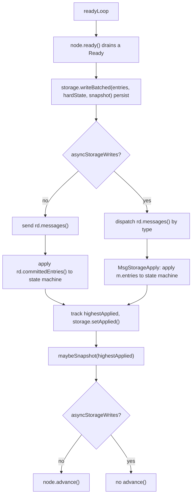
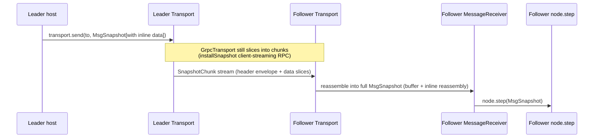
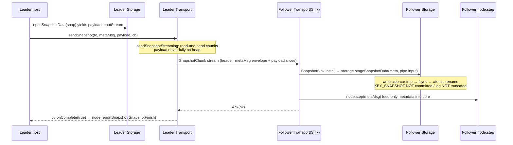
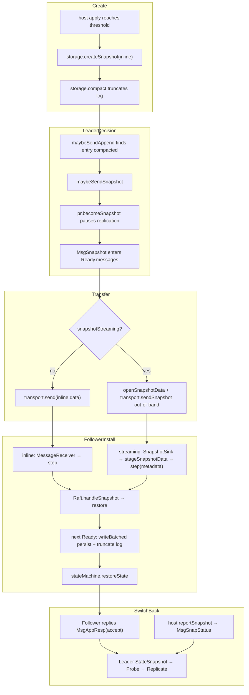

# Snapshot End-to-End Flow (Application → Node → RawNode → Raft)

This document describes the end-to-end snapshot flow in x-raft-lib, covering the
layered call chain and both the **streaming** (out-of-band) and **non-streaming**
(inline) handling paths.

## 1. Layered Architecture & Responsibilities

| Layer | Representative class | Responsibility |
| --- | --- | --- |
| Application / host | `RaftKVNode` | Drives the Ready loop; persists; applies committed entries to the state machine; triggers snapshot creation and log compaction; sends messages |
| State machine | `KvStateMachine` | Serializes/restores business state |
| Node (thread-safe) | `DefaultNode` | Serializes external calls onto the event loop, wraps `RawNode` |
| RawNode (thread-unsafe) | `RawNode` | Assembles `Ready`, handles `advance`, translates host actions into raft messages |
| Raft core | `Raft` | The Raft protocol itself: decides when to send a snapshot, how to restore a received one |
| Storage | `RocksDbStorage` | Persists log/HardState/snapshot; creates snapshots; compacts; manages side-car files |
| Transport | `GrpcTransport` | Network transport; chunked streaming send/receive of snapshots |

Key capability interfaces:
- `Storage.supportsStreamingSnapshot()` — whether Storage supports streaming snapshots.
- `Transport.supportsSnapshotStreaming()` — whether Transport supports out-of-band streaming.
- The host enables the streaming path only when **both** return `true`.

## 2. Capability Negotiation

`RaftKVNode` decides the path at construction time:

```java
this.snapshotStreaming =
        storage.supportsStreamingSnapshot() && transport.supportsSnapshotStreaming();
if (snapshotStreaming) {
    // Register a SnapshotSink: out-of-band snapshots bypass MessageReceiver,
    // land the payload into a Storage side-car first, then feed the
    // metadata-only MsgSnapshot into the core.
    transport.setSnapshotSink((metaMsg, payload) -> {
        storage.stageSnapshotData(metaMsg.getSnapshot(), payload);
        node.step(metaMsg);
    });
}
```

- **streaming = true**: registers a `SnapshotSink`; the receiver installs out-of-band.
- **streaming = false**: no sink; the snapshot flows as an ordinary `MsgSnapshot` via `MessageReceiver → node.step`.

## 3. Phase 1: Snapshot Creation & Log Compaction (host-driven, identical for both modes)

Happens at the end of `RaftKVNode.processReady()`:



`maybeSnapshot` selects creation mode based on `snapshotStreaming`:

```java
private void maybeSnapshot(long applied) {
    if (applied - lastSnapshotIndex < SNAPSHOT_ENTRIES_THRESHOLD) return; // threshold 10_000
    Eraftpb.ConfState cs = storage.initialState().confState();
    if (snapshotStreaming) {
        storage.createSnapshotStreaming(applied, cs, out -> out.write(stateMachine.serializeState()));
    } else {
        storage.createSnapshot(applied, cs, stateMachine.serializeState());
    }
    lastSnapshotIndex = applied;
    storage.compact(applied);                     // truncate log before `applied`
}
```

Notes:
- Trigger: `applied - lastSnapshotIndex >= SNAPSHOT_ENTRIES_THRESHOLD`.
- When `snapshotStreaming = true`, uses `createSnapshotStreaming` (writes a side-car file), keeping the payload off-heap.
- When `snapshotStreaming = false`, uses inline `createSnapshot` (payload in RocksDB).
- After `compact(applied)`, `firstIndex` advances; this is exactly why the leader later needs to send a snapshot to a lagging follower.
- The snapshot creation/send/apply flow in `processReady` is consistent across both sync and async storage write modes; see the [Async Storage Writes documentation](async-storage-writes.md) for details.

## 4. Phase 2: Leader Decides "a Snapshot Is Required" (Raft core)

During replication, if the entry the follower needs has been compacted away, it
cannot be caught up via `MsgAppend`, so a snapshot is sent instead. The core is
in `Raft.maybeSendAppend`:

```java
boolean maybeSendAppend(long to, boolean sendIfEmpty) {
    Progress pr = trk.getProgress().get(to);
    if (pr.isPaused()) return false;               // always true in StateSnapshot → replication paused

    long prevIndex = pr.getNext() - 1;
    RaftLog.TermResult tr = raftLog.termResult(prevIndex);
    if (tr.err() != null) {
        return maybeSendSnapshot(to, pr);          // prevIndex compacted → send snapshot
    }
    // ...
    try {
        ents = raftLog.entries(pr.getNext(), maxMsgSize);
    } catch (RaftException e) {
        return maybeSendSnapshot(to, pr);          // entries compacted → send snapshot
    }
    // ... otherwise send MsgAppend
}
```

`maybeSendSnapshot`:

```java
boolean maybeSendSnapshot(long to, Progress pr) {
    if (!pr.isRecentActive()) return false;        // skip if peer not recently active
    Eraftpb.Snapshot snapshot = raftLog.snapshot(); // fetch from Storage (metadata + possibly inline data)
    // SNAPSHOT_TEMPORARILY_UNAVAILABLE → retry next tick
    pr.becomeSnapshot(sindex);                     // enter StateSnapshot, isPaused()=true pauses append
    send(MsgSnapshot(to, snapshot));               // enqueued into r.msgs(), handed to host via Ready
    return true;
}
```

Key points:
- Once in `StateSnapshot`, `isPaused()` is always `true`, so `maybeSendAppend` returns `false` — **all log replication to that follower is paused during snapshot transfer**, until a result switches it back to `StateProbe`.
- The `MsgSnapshot` is placed into `r.msgs()` and surfaces in `Ready.messages()` via `RawNode.ready()` for the host to send.

## 5. Phase 3: Snapshot Transfer (the fork between the two modes)

While iterating `rd.messages()` in `processReady`, the host routes by mode:

```java
for (Eraftpb.Message m : rd.messages()) {
    if (m.getTo() == id) continue;
    if (snapshotStreaming && m.getMsgType() == MsgSnapshot) {
        sendSnapshotOutOfBand(m);   // 5B streaming out-of-band
    } else {
        transport.send(m.getTo(), m); // 5A inline (and all non-snapshot messages)
    }
}
```

### 5A. Non-streaming (inline path)

The `MsgSnapshot`'s `snapshot.data` carries the full payload and is sent as an ordinary message.



- Wire encoding: chunk0 = `[4B envelope length][envelope (MsgSnapshot with data cleared)][first data slice]`, subsequent chunks are pure data slices; the receiver reassembles the full `MsgSnapshot`.
- If the Transport does not support streaming at all, the default `Transport.sendSnapshot` materializes the payload into `snapshot.data` and falls back to `send`.
- With no `SnapshotSink` registered, the receiver goes through `MessageReceiver → node.step`, holding the payload on heap end to end.

### 5B. Streaming (out-of-band, zero-copy path)

The `MsgSnapshot` carries metadata only (`snapshot.data` empty); the payload streams Storage→Storage out of band.

```java
private void sendSnapshotOutOfBand(Eraftpb.Message m) {
    InputStream in = storage.openSnapshotData(m.getSnapshot()); // side-car stream if present, else inline fallback
    transport.sendSnapshot(to, m, in, (ok, err) -> {
        node.reportSnapshot(to, ok ? SnapshotFinish : SnapshotFailure); // completion callback
    });
}
```



- **Zero-copy essence**: `GrpcTransport.sendSnapshotStreaming` reads the `InputStream` with a fixed buffer and emits chunks, so a multi-GB snapshot never fully resides on heap; the receiver `RaftServiceImpl.installSnapshot` uses `PipedInputStream/OutputStream` + a worker thread to feed the stream straight to the `SnapshotSink`.
- **Stage, not apply directly**: on receipt, the follower first `stageSnapshotData` lands the payload into a side-car, but **does not commit** `KEY_SNAPSHOT` and **does not truncate** the log. This keeps the core's `restore` seeing the OLD storage state and performing a real restore (otherwise `matchTerm` would read the committed metadata, wrongly believe "already have it", ignore the snapshot, and strand `applied` behind a compacted log).
- Transport is a client-streaming RPC; the server returns a single `Ack` at the end, which the leader maps to `reportSnapshot`.

## 6. Phase 4: Follower Core Installs the Snapshot (restore)

In either mode, the `MsgSnapshot` (inline with data / streaming metadata-only) eventually reaches `node.step → Raft.handleSnapshot`:

```java
void handleSnapshot(Eraftpb.Message m) {
    Eraftpb.Snapshot s = m.getSnapshot();
    if (restore(s)) {
        send(appendRespAccept(m.getFrom(), raftLog.lastIndex())); // accepted → MsgAppResp
    } else {
        send(appendRespAccept(m.getFrom(), raftLog.committed));   // ignored (stale / already contained)
    }
}
```

`restore(s)` decisions:
- `s.index <= committed` → return false (stale).
- Not a follower → reject (defensive).
- Self id not in ConfState → reject.
- If local log already `matchTerm(snapID)` → only `commitTo`, no full restore (fast-forward).
- Otherwise `raftLog.restore(s)`, rebuild `ProgressTracker` and config, return true.

`restore` only updates in-memory core state (unstable snapshot). Actual persistence happens in the **next Ready cycle**: `RawNode.readyWithoutAccept` detects `hasNextUnstableSnapshot()`, places the snapshot into `Ready.snapshot`, and the host calls `writeBatched(...)` again:

```java
// snapshot handling inside RocksDbStorage.writeBatched
if (snapApplied && alreadyInstalledOutOfBand(snap)) {
    snapApplied = false;                       // streaming already staged out-of-band, skip re-write
} else if (snapApplied && snap.getData().isEmpty()) {
    // metadata-only with an already-staged side-car → link the file at commit
    linkFile = sidecarName(index, term);
}
// atomic write: KEY_SNAPSHOT + (KEY_SNAPSHOT_FILE or delete) + deleteRange to truncate log
```

The host then restores the snapshot data into the state machine:

```java
if (rd.snapshot().getMetadata().getIndex() > 0) {
    byte[] appData;
    if (snapshotStreaming) {
        try (InputStream sin = storage.openSnapshotData(rd.snapshot())) {
            appData = sin.readAllBytes();       // read back from side-car
        }
    } else {
        appData = rd.snapshot().getData().toByteArray(); // inline directly
    }
    if (appData.length > 0) stateMachine.restoreState(appData);
}
```

## 7. Phase 5: Completion Callback & State Switch-back

After a successful install, the follower replies with a `MsgAppResp` (accept); the leader handles it in `stepLeader`:

```java
case StateSnapshot:
    if (pr.getMatch() + 1 >= r.raftLog.firstIndex()) {
        pr.becomeProbe();       // snapshot brought match up to firstIndex
        pr.becomeReplicate();   // resume normal replication
    }
    break;
```

Separately, the host reports the send result via `node.reportSnapshot(id, status)`, translated into `MsgSnapStatus`:

```java
case MsgSnapStatus:
    if (pr.getState() != StateType.StateSnapshot) return;
    if (!m.getReject()) pr.becomeProbe();          // success → back to Probe, pause lifted
    else { pr.setPendingSnapshot(0); pr.becomeProbe(); } // failure → reset then Probe, may resend next round
    pr.setMsgAppFlowPaused(true);
    break;
```

At this point the follower has caught up via the snapshot, the leader resumes normal log replication, and the cluster converges.

## 8. Mode Comparison

| Dimension | Non-streaming (inline) | Streaming (out-of-band) |
| --- | --- | --- |
| Enable condition | Either side lacks streaming | Both Storage and Transport support it |
| `MsgSnapshot.data` | Carries full payload | Empty (metadata only) |
| Payload transfer | Rides the message via `transport.send` (gRPC still chunks internally) | `transport.sendSnapshot` out-of-band, zero-copy |
| Receive routing | `MessageReceiver → node.step` | `SnapshotSink → stageSnapshotData → node.step(metadata)` |
| Follower persistence | `writeBatched` writes inline data into `cfSnap` | `stageSnapshotData` first lands side-car, `writeBatched` links the file pointer |
| State-machine data source | `rd.snapshot().getData()` | `storage.openSnapshotData()` reads the side-car |
| Memory footprint | Whole payload on heap | Payload not fully on heap, fits multi-GB snapshots |
| Completion reporting | No explicit callback (delivery suffices) | `sendSnapshot` callback → `node.reportSnapshot` |

## 9. End-to-End Overview


