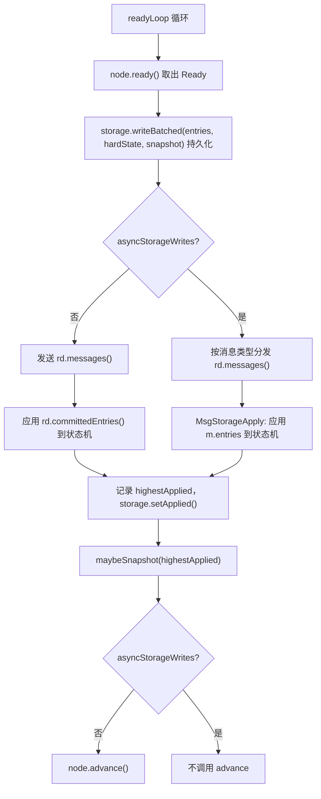
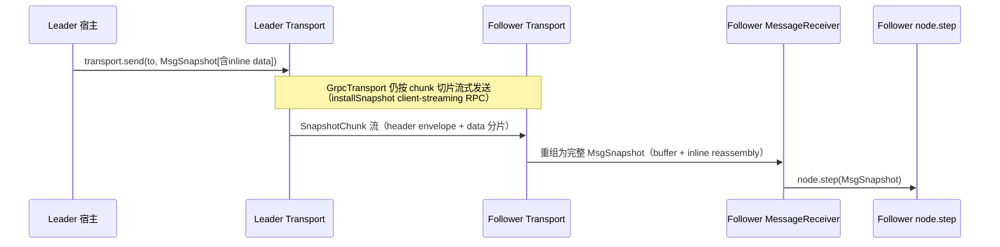
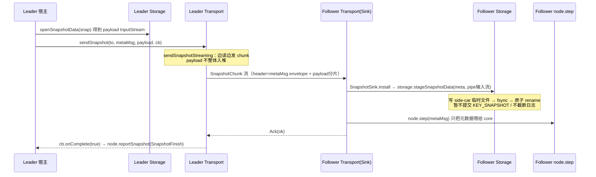
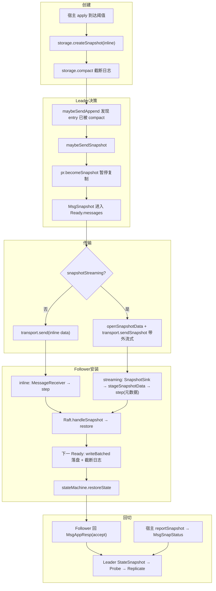

# Snapshot 完整流程文档（应用层 → Node → RawNode → Raft）

本文档梳理 x-raft-lib 中快照（Snapshot）功能的端到端流程，覆盖分层调用关系，
以及「支持流式传输（streaming）」与「不支持流式传输（inline）」两种处理方式。

## 1. 分层架构与职责

| 层 | 代表类 | 职责 |
| --- | --- | --- |
| 应用层 / 宿主 | `RaftKVNode` | 驱动 Ready 循环；持久化；应用已提交条目到状态机；触发快照创建与日志 compact；发送消息 |
| 状态机 | `KvStateMachine` | 序列化/恢复业务状态 |
| Node（线程安全） | `DefaultNode` | 把外部调用串行化到事件循环，包装 `RawNode` |
| RawNode（线程不安全） | `RawNode` | 组装 `Ready`、`advance`、把宿主动作翻译成 raft 消息 |
| Raft 核心 | `Raft` | Raft 协议本体：决定何时发快照、收到快照如何 restore |
| Storage | `RocksDbStorage` | 落盘日志/HardState/快照；创建快照；compact；side-car 文件管理 |
| Transport | `GrpcTransport` | 消息网络传输；快照 chunk 流式收发 |

关键抽象接口：
- `Storage.supportsStreamingSnapshot()` —— Storage 是否支持流式快照。
- `Transport.supportsSnapshotStreaming()` —— Transport 是否支持带外（out-of-band）流式快照。
- 两者同时为 `true` 时，宿主才启用 streaming 路径。

## 2. 能力协商

`RaftKVNode` 构造时决定走哪条路径：

```java
this.snapshotStreaming =
        storage.supportsStreamingSnapshot() && transport.supportsSnapshotStreaming();
if (snapshotStreaming) {
    // 注册 SnapshotSink：带外快照不再经过 MessageReceiver，
    // 而是先把 payload 落到 Storage side-car，再把元数据 MsgSnapshot 喂给 core。
    transport.setSnapshotSink((metaMsg, payload) -> {
        storage.stageSnapshotData(metaMsg.getSnapshot(), payload);
        node.step(metaMsg);
    });
}
```

- **streaming = true**：注册 `SnapshotSink`，接收端走带外流式安装。
- **streaming = false**：不注册 sink，快照作为普通 `MsgSnapshot` 走 `MessageReceiver → node.step`。

## 3. 阶段一：快照创建与日志 compact（宿主驱动，两种模式一致）

发生在 `RaftKVNode.processReady()` 的末尾：



`maybeSnapshot` 根据 `snapshotStreaming` 选择创建方式：

```java
private void maybeSnapshot(long applied) {
    if (applied - lastSnapshotIndex < SNAPSHOT_ENTRIES_THRESHOLD) return; // 阈值 10_000
    Eraftpb.ConfState cs = storage.initialState().confState();
    if (snapshotStreaming) {
        storage.createSnapshotStreaming(applied, cs, out -> out.write(stateMachine.serializeState()));
    } else {
        storage.createSnapshot(applied, cs, stateMachine.serializeState());
    }
    lastSnapshotIndex = applied;
    storage.compact(applied);                     // 截断 applied 之前的日志
}
```

要点：
- 触发条件：`applied - lastSnapshotIndex >= SNAPSHOT_ENTRIES_THRESHOLD`。
- `snapshotStreaming = true` 时使用 `createSnapshotStreaming`（写独立 side-car 文件），payload 不驻留堆内存。
- `snapshotStreaming = false` 时使用 inline `createSnapshot`（payload 存 RocksDB）。
- `compact(applied)` 之后，`firstIndex` 前移；这正是后续 Leader 需要给落后 Follower 发快照的根因。
- `processReady` 中的快照创建/发送/应用流程在同步和异步两种存储写入模式下均一致，详见 [异步存储写入文档](async-storage-writes.zh.md)。

## 4. 阶段二：Leader 判定「必须发快照」（Raft 核心）

Leader 在复制时，若 Follower 需要的 entry 已被 compact 掉，则无法用 `MsgAppend` 追平，
转而发快照。核心在 `Raft.maybeSendAppend`：

```java
boolean maybeSendAppend(long to, boolean sendIfEmpty) {
    Progress pr = trk.getProgress().get(to);
    if (pr.isPaused()) return false;               // StateSnapshot 期间恒为 true → 暂停复制

    long prevIndex = pr.getNext() - 1;
    RaftLog.TermResult tr = raftLog.termResult(prevIndex);
    if (tr.err() != null) {
        return maybeSendSnapshot(to, pr);          // prevIndex 已被 compact → 发快照
    }
    // ...
    try {
        ents = raftLog.entries(pr.getNext(), maxMsgSize);
    } catch (RaftException e) {
        return maybeSendSnapshot(to, pr);          // entries 被 compact → 发快照
    }
    // ... 正常发 MsgAppend
}
```

`maybeSendSnapshot`：

```java
boolean maybeSendSnapshot(long to, Progress pr) {
    if (!pr.isRecentActive()) return false;        // 对方近期不活跃则不发
    Eraftpb.Snapshot snapshot = raftLog.snapshot(); // 从 Storage 取快照（元数据+可能的inline data）
    // SNAPSHOT_TEMPORARILY_UNAVAILABLE → 下个 tick 再试
    pr.becomeSnapshot(sindex);                     // 进入 StateSnapshot，isPaused()=true 暂停 append
    send(MsgSnapshot(to, snapshot));               // 放入 r.msgs()，经 Ready 交给宿主发送
    return true;
}
```

关键点：
- 进入 `StateSnapshot` 后 `isPaused()` 恒为 `true`，`maybeSendAppend` 直接返回 `false`，
  即**快照传输期间暂停向该 Follower 复制任何日志**，直到收到快照结果切回 `StateProbe`。
- `MsgSnapshot` 此时被放入 `r.msgs()`，经由 `RawNode.ready()` 出现在 `Ready.messages()` 中，交回宿主发送。

## 5. 阶段三：快照传输（两种模式分叉点）

宿主在 `processReady` 中遍历 `rd.messages()` 时按模式分流：

```java
for (Eraftpb.Message m : rd.messages()) {
    if (m.getTo() == id) continue;
    if (snapshotStreaming && m.getMsgType() == MsgSnapshot) {
        sendSnapshotOutOfBand(m);   // 5B 流式带外
    } else {
        transport.send(m.getTo(), m); // 5A inline（含非快照消息）
    }
}
```

### 5A. 不支持 streaming（inline 路径）

`MsgSnapshot` 的 `snapshot.data` 携带完整 payload，作为普通消息发送。



- 传输编码：chunk0 = `[4B envelope长度][envelope(清空data的MsgSnapshot)][首段data]`，
  后续 chunk 为纯 data 分片；接收端重组回完整 `MsgSnapshot`。
- 若 Transport 完全不支持流式，`Transport.sendSnapshot` 默认实现会把 payload
  materialize 进 `snapshot.data` 后走 `send`（兜底）。
- 接收端未注册 `SnapshotSink`，走 `MessageReceiver → node.step`，payload 全程在堆内存。

### 5B. 支持 streaming（out-of-band 零拷贝路径）

`MsgSnapshot` 只带元数据（`snapshot.data` 为空），payload 通过 Storage→Storage 带外流式传输。

```java
private void sendSnapshotOutOfBand(Eraftpb.Message m) {
    InputStream in = storage.openSnapshotData(m.getSnapshot()); // 有side-car取文件流，否则回退inline
    transport.sendSnapshot(to, m, in, (ok, err) -> {
        node.reportSnapshot(to, ok ? SnapshotFinish : SnapshotFailure); // 完成回调
    });
}
```



- **零拷贝关键**：`GrpcTransport.sendSnapshotStreaming` 用固定 buffer 边读 `InputStream` 边发 chunk，
  多 GB 快照不会整体驻留堆内存；接收端 `RaftServiceImpl.installSnapshot` 用 `PipedInputStream/OutputStream` + worker 线程把流直接灌给 `SnapshotSink`。
- **stage 而非直接 apply**：Follower 收到时先 `stageSnapshotData` 把 payload 落 side-car，
  但**不提交** `KEY_SNAPSHOT`、**不截断日志**。这样 core 的 `restore` 仍看到旧存储状态、
  执行真正的 restore（否则 `matchTerm` 读到已提交元数据会误判“已拥有”而忽略快照，导致 applied 落在被 compact 的日志之后）。
- 传输为 client-streaming RPC，服务端结束时回一个 `Ack`，Leader 侧据此触发 `reportSnapshot`。

## 6. 阶段四：Follower core 安装快照（restore）

无论哪种模式，`MsgSnapshot`（inline 带 data / streaming 仅元数据）最终都进入 `node.step → Raft.handleSnapshot`：

```java
void handleSnapshot(Eraftpb.Message m) {
    Eraftpb.Snapshot s = m.getSnapshot();
    if (restore(s)) {
        send(appendRespAccept(m.getFrom(), raftLog.lastIndex())); // 接受 → MsgAppResp
    } else {
        send(appendRespAccept(m.getFrom(), raftLog.committed));   // 忽略（过期/已包含）
    }
}
```

`restore(s)` 的判定：
- `s.index <= committed` → 返回 false（过期）。
- 非 Follower 身份 → 拒绝（防御）。
- ConfState 中不含自身 id → 拒绝。
- 若本地 log 已 `matchTerm(snapID)` → 只 `commitTo`，无需完整 restore（fast-forward）。
- 否则 `raftLog.restore(s)`，重建 `ProgressTracker` 与配置，返回 true。

`restore` 只更新 core 内存状态（unstable snapshot）。真正落盘发生在**下一个 Ready 循环**：
`RawNode.readyWithoutAccept` 检测到 `hasNextUnstableSnapshot()`，把快照放进 `Ready.snapshot`，
宿主再次 `writeBatched(...)`：

```java
// RocksDbStorage.writeBatched 中对快照的处理
if (snapApplied && alreadyInstalledOutOfBand(snap)) {
    snapApplied = false;                       // streaming 已带外 stage 过，跳过重复写
} else if (snapApplied && snap.getData().isEmpty()) {
    // 元数据-only 且存在已 stage 的 side-car → 提交时关联该文件
    linkFile = sidecarName(index, term);
}
// 原子写：KEY_SNAPSHOT + (KEY_SNAPSHOT_FILE 或删除) + deleteRange 截断日志
```

宿主随后把快照数据恢复进状态机：

```java
if (rd.snapshot().getMetadata().getIndex() > 0) {
    byte[] appData;
    if (snapshotStreaming) {
        try (InputStream sin = storage.openSnapshotData(rd.snapshot())) {
            appData = sin.readAllBytes();       // 从 side-car 读回
        }
    } else {
        appData = rd.snapshot().getData().toByteArray(); // inline 直接取
    }
    if (appData.length > 0) stateMachine.restoreState(appData);
}
```

## 7. 阶段五：完成回调与状态回切

Follower 安装成功后回给 Leader 一个 `MsgAppResp`（accept），Leader 在 `stepLeader` 中处理：

```java
case StateSnapshot:
    if (pr.getMatch() + 1 >= r.raftLog.firstIndex()) {
        pr.becomeProbe();       // 快照已让 match 追上 firstIndex
        pr.becomeReplicate();   // 恢复正常复制
    }
    break;
```

另外，宿主通过 `node.reportSnapshot(id, status)` 上报发送结果，翻译为 `MsgSnapStatus`：

```java
case MsgSnapStatus:
    if (pr.getState() != StateType.StateSnapshot) return;
    if (!m.getReject()) pr.becomeProbe();          // 成功 → 回到 Probe，解除暂停
    else { pr.setPendingSnapshot(0); pr.becomeProbe(); } // 失败 → 重置后 Probe，下轮可重发
    pr.setMsgAppFlowPaused(true);
    break;
```

至此 Follower 通过快照追平，Leader 恢复对其正常的日志复制，集群收敛。

## 8. 两种模式对比

| 维度 | 不支持 streaming（inline） | 支持 streaming（out-of-band） |
| --- | --- | --- |
| 启用条件 | 任一端不支持流式 | Storage 与 Transport 均支持 |
| `MsgSnapshot.data` | 携带完整 payload | 空（仅元数据） |
| payload 传输 | 随消息经 `transport.send`（gRPC 内部仍分 chunk） | `transport.sendSnapshot` 带外流式，零拷贝 |
| 接收路由 | `MessageReceiver → node.step` | `SnapshotSink → stageSnapshotData → node.step(元数据)` |
| Follower 落盘 | `writeBatched` 写 inline data 到 `cfSnap` | 先 `stageSnapshotData` 落 side-car，`writeBatched` 关联文件指针 |
| 恢复状态机数据来源 | `rd.snapshot().getData()` | `storage.openSnapshotData()` 读 side-car |
| 内存占用 | 整个 payload 驻留堆内存 | payload 不整体入堆，适合多 GB 快照 |
| 完成上报 | 无显式回调（消息投递即可） | `sendSnapshot` 回调 → `node.reportSnapshot` |

## 9. 端到端时序总览


